<style>
body {
    background-color: #f5f8b8fd; /* Light grey background */
    color: #333;               /* Dark grey text */
    padding: 50px;             /* Optional padding for the PDF edges */
}
pre, code {
    background-color: #e8e8e8; /* Background for code blocks */
}
</style>

# Homnework 02 Frolov Ivan

### Как запустить

```
sudo java -jar target/IvanFrolov-1.0-SNAPSHOT-jar-with-dependencies.jar
```

### Определяем Local IP, Router IP, Local MAC, Router MAC 

**---Первое----**
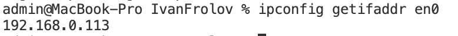
**-------**

**--Второе-----**
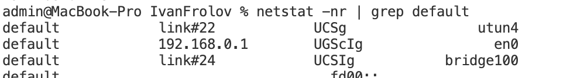
**-------**

**---Третье----**
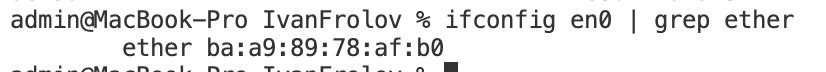
**-------**

**---Четвертое----**
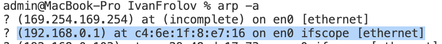
**-------**

Все это кладем в `config.properties`


### File structure 

App - основное приложение

ArpScanner - сканирует ARP пакеты в локальной сети в течение какого-то промежутка времени

ArpSender - отправляет ARP запрос роутеру

Config - вспомогательный класс, который загружает конфигурации из `config.properties`

При запуске приложения меню выгдит так: 
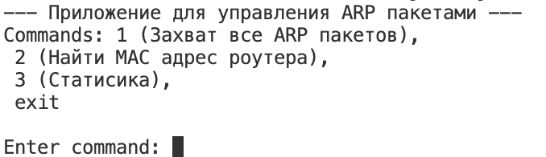

Далее про каждую команду более подробно

### Команда 1: захват ARP пакетов

Вывод захваченных ARP-пакетов в реальном времени (интерпретация полей).
    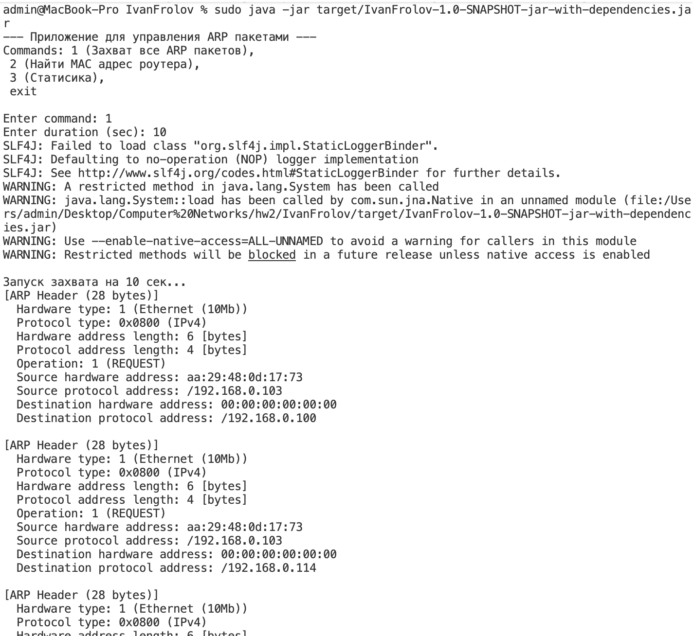

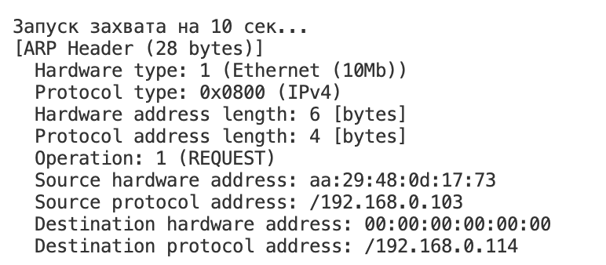 

   Hardware type: 1 (Ethernet) - пакет передается в сети Ethernet.    
   Protocol type: 0x0800 (IPv4) - ARP преобразует адреса для протокола IPv4.     
   Hardware address length: 6 - длина MAC (6 байт)  
   Protocol address length: 4: - длина IP (4 байт)  
   Operation: 1 (REQUEST) - в данном случае это запрос  
   Source hardware address (aa:29:48:0d:17:73) - MAC адрес отправителя  
   Source protocol address (192.168.0.103) - IP адрес отправителя   
   Destination hardware address (00:00:00:00:00:00) - заполнено нулями, так как отправитель не знает MAC адреса   
   Destination protocol address (192.168.0.114) - IP устройства, MAC которого мы ищем    

   В WireShark все это выглядит примерно так    
   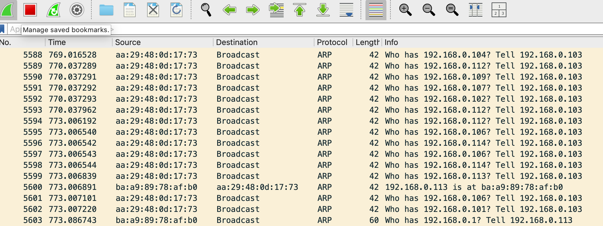

### Команда 2: выяснить MAC адрес роутера

Для этого отправляем Arp запрос на IP адрес роутера в локальной сети

Выполнение команды в терминале: 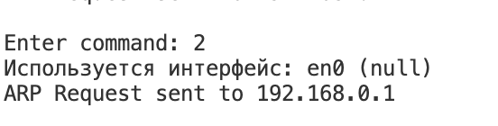      
Запрос в WireShark: 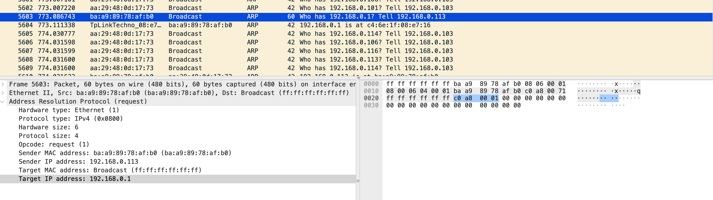      
Ответ в WireShart: 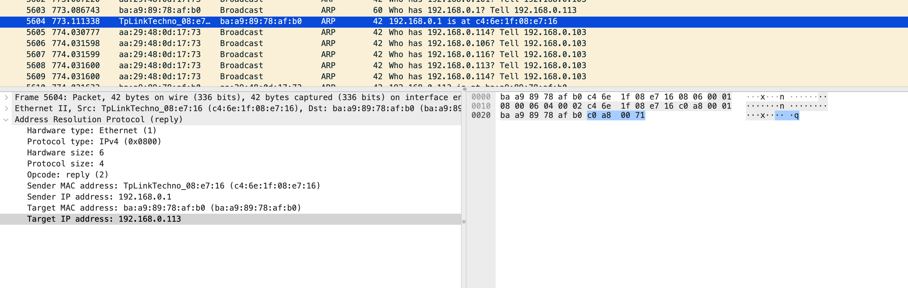     

Ура! Вроде как MAC адрес роутера нашли и он совпадает с тем, который мы получили через `arp -a`

### Команда 3: статистика 


Примечание: промежуток времени был выбран 10 секунд

Ответы на вопросы:

- **Почему обнаружено именно столько уникальных MAC?** 
  В локальной сети видны MAC-адреса всех активных устройств, общающихся в данный момент: сетевые интерфейсы роутера, другие компьютеры, смартфоны, IoT-устройства
- **Как рассчитывается объем данных в байтах?** 
  Объем рассчитывается как сумма длин всех Ethernet-фреймов (L2). Он включает заголовок Ethernet, полезную нагрузку (IP/ARP) и Padding, если нагрузка меньше 46 байт


### Контрольные вопросы

1.  **Для каких целей нужны ARP targeted requests/responses? Какова их структура?** 
Они используются для определение MAC адреса у определенного IP адреса. В запросе Target MAC обнулен, в ответе — заполнен.   
Структура:
 
2.  **Gratuitous ARP:** Запрос, где Source IP = Target IP. Используется для объявления своего присутствия в сети и предотвращения конфликтов адресов.