<style>
body {
    background-color: #f5f8b8fd; /* Light grey background */
    color: #333;               /* Dark grey text */
    padding: 50px;             /* Optional padding for the PDF edges */
}
pre, code {
    background-color: #e8e8e8; /* Background for code blocks */
}
</style>

# ОТЧЕТ ПО HW3
# Фролов Иван Григорьевич 
# БПИ-235 

### Цель работы
Разобраться как работает передача DNS пакетов

Сначала находим наш интерейс 

### Шаг 0. Определяем Local IP, Router IP, Local MAC, Router MAC 

**---Первое----**
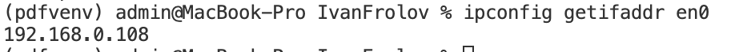
**-------**

**--Второе-----**
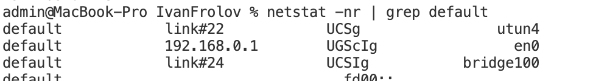
**-------**

**---Третье----**
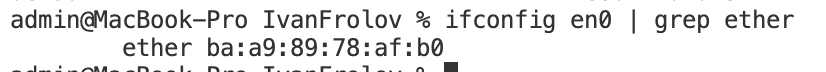
**-------**

**---Четвертое----**
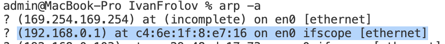
**-------**

Все это кладем в `config.properties`

**Root DNS взяли вот такой:**
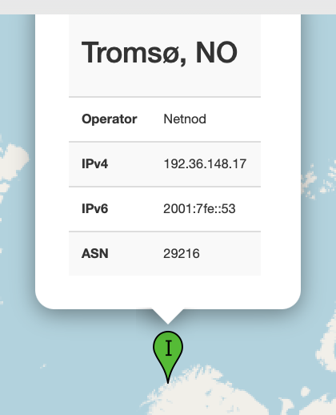

**Я использую DNS от WARP (1.1.1.1), так что чтобы узнать DNS провайдера его пришлось отключить )**

Результат:
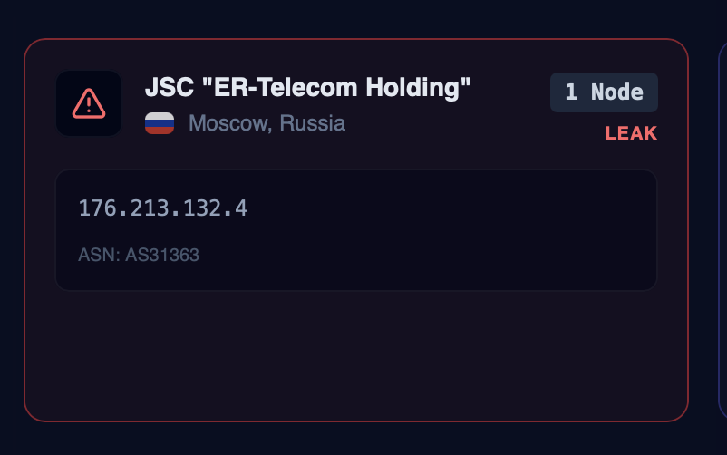


### Экспериментальная установка / подтверждения

Запускаем программу:    
`sudo java -jar target/IvanFrolov-1.0-SNAPSHOT-jar-with-dependencies.jar`

Интерфейс выглядит так: 
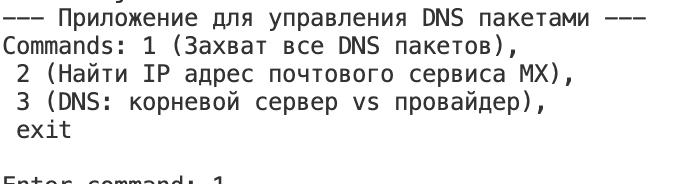

Приведите факты, что приложение и DNS серверы взаимодействовали:
- Скриншоты командной строки (IP/MAC, DNS серверы)
- Скриншоты WireShark (развернут DNS header/sections)
- Иные факты

### Задача 1: Захват любых DNS

Вот например ловим DNS на YouTube 
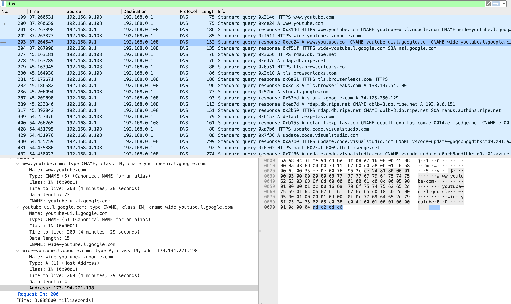

Через цепочку Alias (там две записи CNAME) видим, что в конечном итоге домент резолвится как 173.194.221.198

**После зайдем на GitHub** 

Наше приложение выводит: 

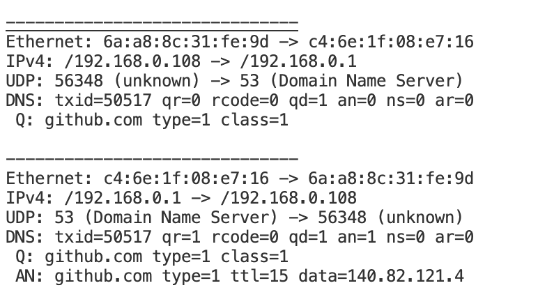

То есть видим сначала DNS запрос на порт 53 
И потом приходит нам ответ, что IP = 140.82.121.4


То же самое в WireShark
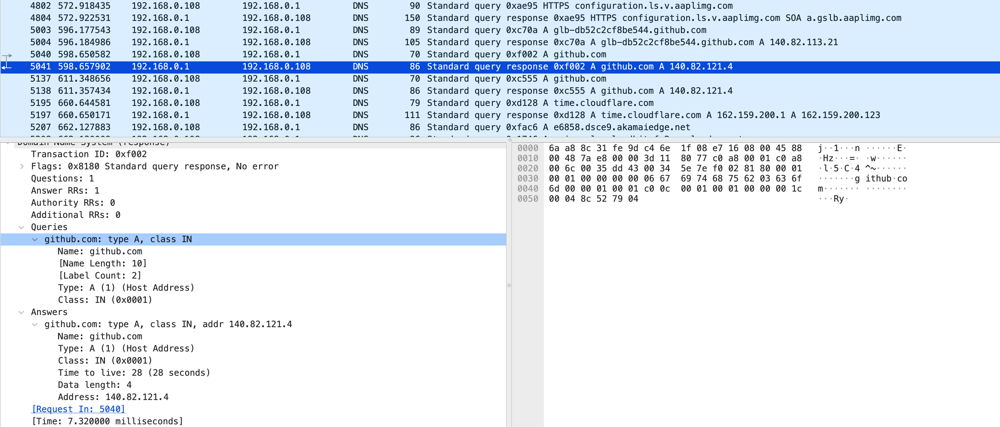

Оказывается GitHub более открытый чем Google, зарезовил домен без CNAME, сразу запись типа A

**Интерпретация:** 

```
Кадр 1: DNS‑запрос

Ethernet‑уровень:

Отправитель: 6a:a8:8c:31:fe:9d (клиент).

Получатель: c4:6e:1f:08:e7:16 (DNS‑сервер).

IP‑уровень (IPv4):

Источник: 192.168.0.108 (клиент).

Назначение: 192.168.0.1 (роутер).

Транспортный уровень (UDP):

Порт источника: 56348 (временный порт клиента).

Порт назначения: 53 (стандартный порт DNS).

DNS‑заголовок:

txid=50517 — идентификатор транзакции (позволяет соотнести запрос и ответ).

qr=0 — это запрос (Query).

rcode=0 — код ответа 0 (No Error), в запросе всегда 0.

qd=1 — в секции вопросов (Question) 1 запись.

an=0, ns=0, ar=0 — секции ответов (Answer), авторитетных серверов (Authority) и дополнительных записей (Additional) пусты.

Секция вопроса (Question):

Имя: github.com — запрашиваемое доменное имя.

Тип: type=1 — запрос типа A‑записи (IPv4‑адрес).

Класс: class=1 — класс IN (Internet).
```

```
Кадр 2: DNS‑ответ

Ethernet‑уровень:

Отправитель: c4:6e:1f:08:e7:16 (DNS‑сервер).

Получатель: 6a:a8:8c:31:fe:9d (клиент).

IP‑уровень (IPv4):

Источник: 192.168.0.1 (DNS‑сервер).

Назначение: 192.168.0.108 (клиент).

Транспортный уровень (UDP):

Порт источника: 53 (DNS‑сервер).

Порт назначения: 56348 (порт клиента из запроса).

DNS‑заголовок:

txid=50517 — тот же идентификатор, что в запросе (ответ соответствует запросу).

qr=1 — это ответ (Response).

rcode=0 — ошибок нет (No Error).

qd=1 — секция вопросов сохранена (1 запись).

an=1 — в секции ответов 1 запись (успешный резолв).

ns=0, ar=0 — секции Authority и Additional пусты.

Секция вопроса (Question):
Повторяет запрос: github.com, type=1, class=1.

Секция ответа (Answer):

Имя: github.com.

Тип: type=1 — A‑запись (IPv4).

TTL: ttl=15 — время жизни записи 15 секунд (кэш будет актуален 15 с).

Данные: data=140.82.121.4 — IPv4‑адрес для github.com.
```


### Задача 2: MX -> IPmx (2 шага)
- Скриншоты WireShark: запрос(ы) MX, ответ(ы), запрос(ы) A/AAAA, ответ(ы)
- Скриншот вывода приложения (результат `D -> IPmx`)

Запрашиваем MX запись Яндекса 
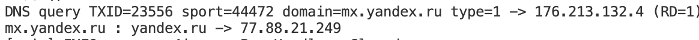

То же самое в WireShark 

Шаг 1 - получили MX запись с доментом mx.yandex.ru 
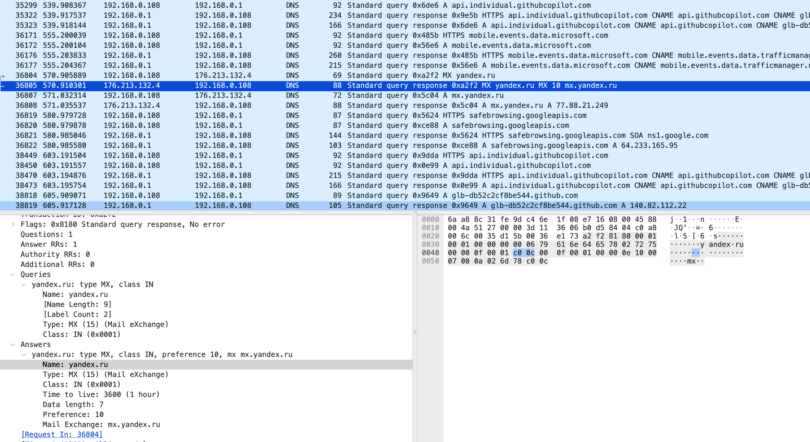

Шаг 2 - по этому домену нашли IP для MX сервера 
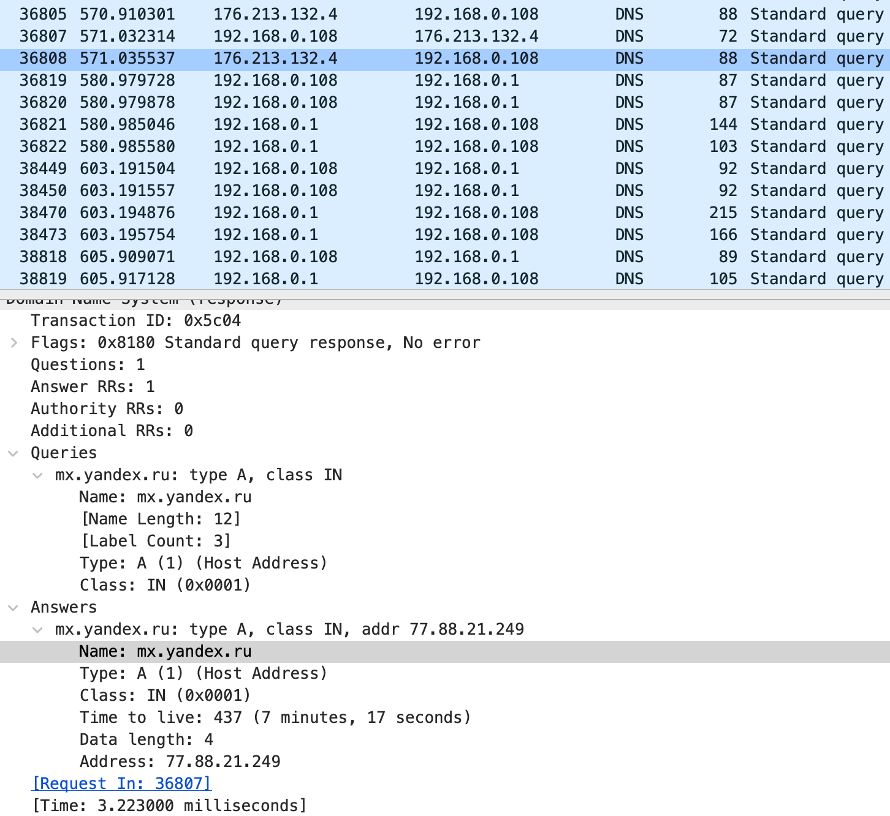

### Задача 3: Root DNS vs Provider DNS

#### (a) Root server
- Скриншоты WireShark (запрос/ответ) ниже 
- Ответ на вопрос: что выдает корневой сервер?

Тут видим что от GitHub и hse.ru не получили ответа     
А вот от draw.io получили   
Я использовал DNS в Новосибирске (тот который я показывал выше в Финляндии вообще не работал)   
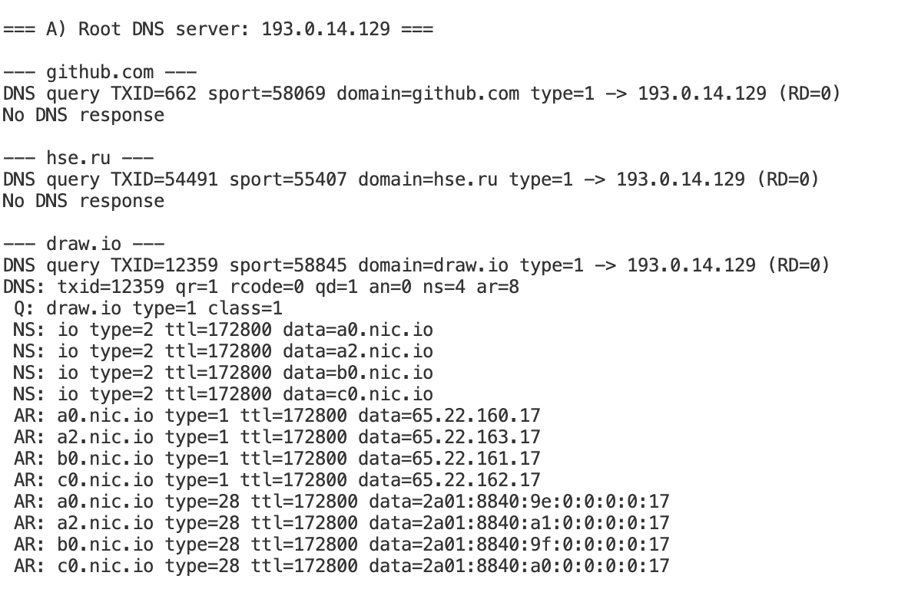
Небольшое пояснение: 
- NS это секция с авторитетными DNS серверами для данного домена 
- AR это секция где у нас IP адреса этих авторитетных серверов


#### (b) Provider DNS
- Скриншоты WireShark (запрос/ответ) ниже
- Ответ на вопрос: какой ответ дает провайдер?

А вот от провайдера получили все!       
В чем я думаю причина: я использовал VPN    
И через провадера все шло через VPN.    
А если брать стороннего провайдера, то видимо DNS запрос улетал на него без VPN, соответственно так как DNS сервер в РФ, то там все и заблокировано (хотя при этом hse.ru тоже не ответил)
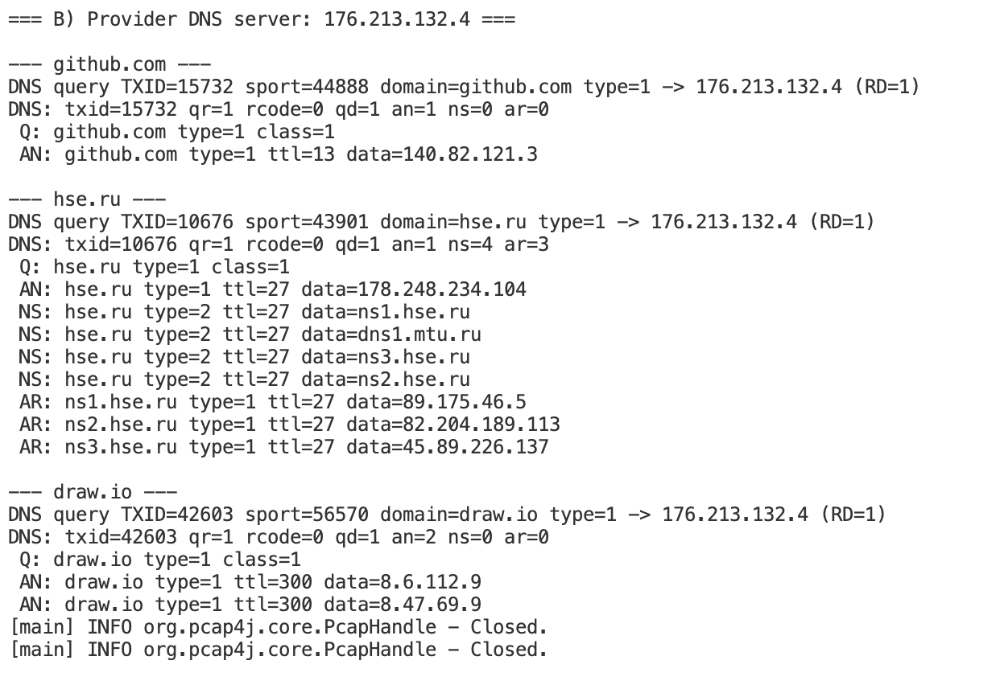

#### (с) Тестируем и Root, и провайдера но уже без VPN

Пробую еще один внешний Root DNS, но уже в Баку 
VPN выключаю    

Теперь работает вообще все!

На Root DNS:    
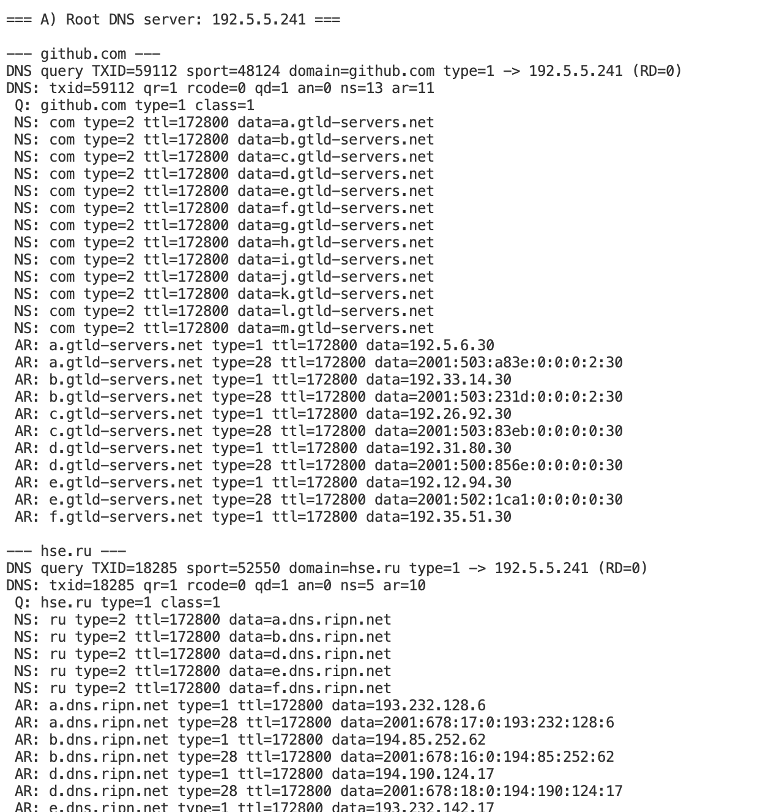

На DNS провайдера:  

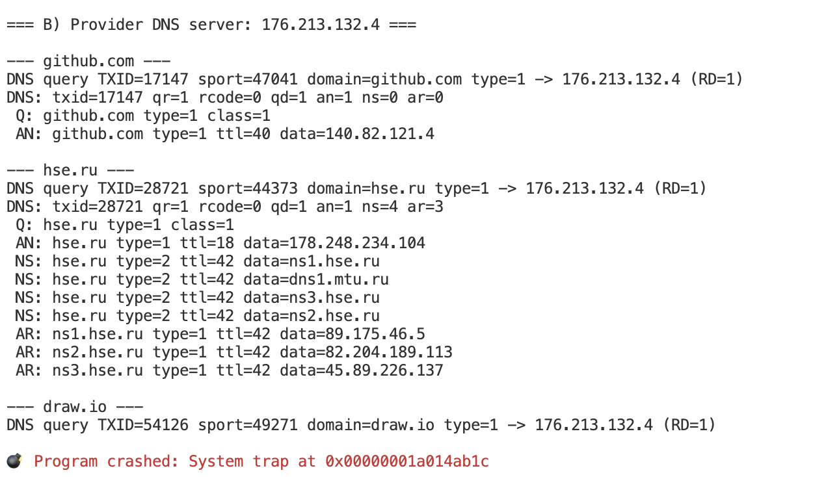

Прмечание: там в конце программа крашнулась это на Mac какая-то особенность иногда так происходит из-за версии Java и совместимости пакетов, как я понял

Скриншоты из WireShark (тут видно draw IO, hse.ru, github.com)

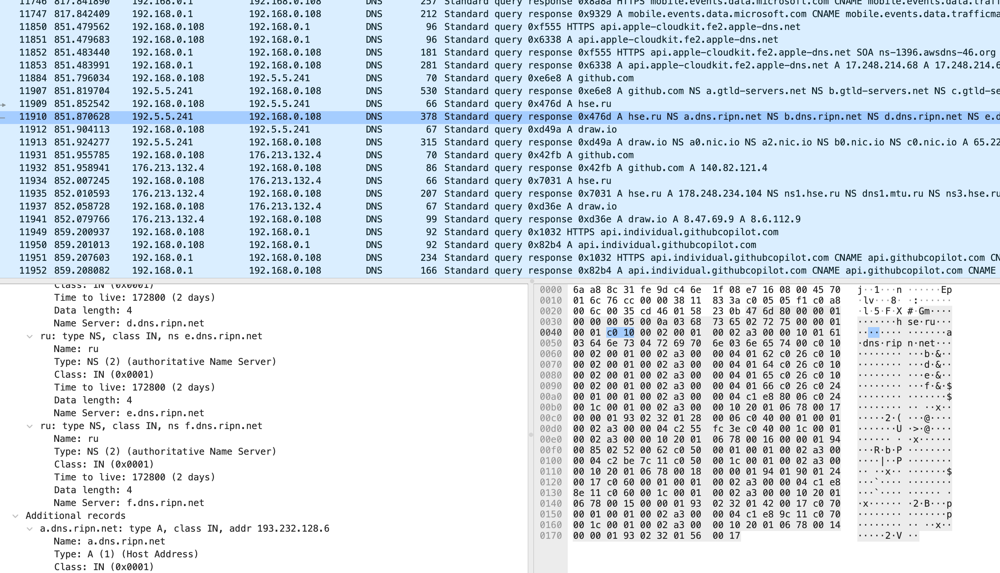
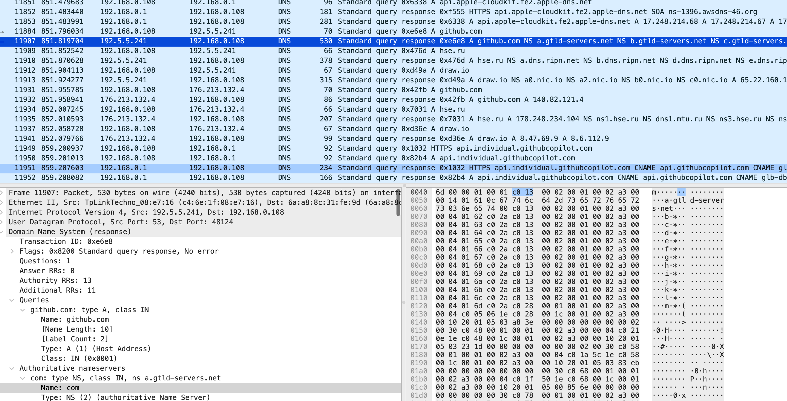
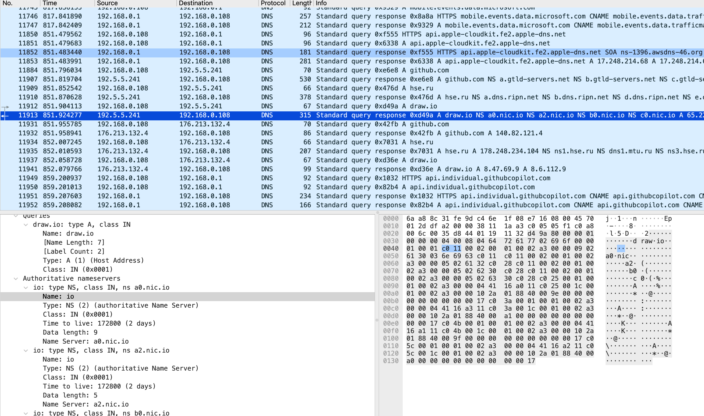


### Видео
- https://disk.360.yandex.ru/i/O9YFiFSSx-CO-A
- На видео: запуск, видны пакеты и ответы


