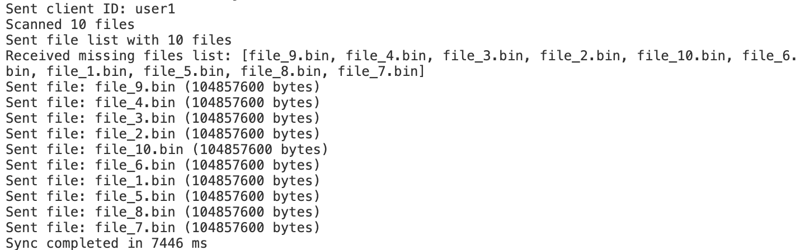
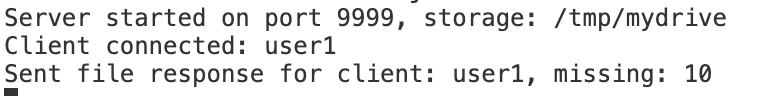
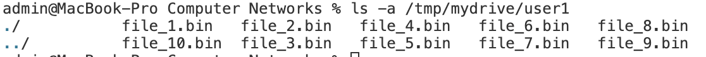

<style>
body {
    background-color: #f5f8b8fd;
    color: #333;
    padding: 50px;
}
pre, code {
    background-color: #e8e8e8;
}
</style>

# ОТЧЕТ ПО HW4

# Фролов Иван Григорьевич 
# БПИ-235 

### Цель работы

написать файловое хранилище MyDrive с использованием Java/Netty Framework и протокола TCP.

Хотим сделать клиент-серверное приложение, где:
- Клиент синхронизирует директорию с сервером
- Сервер хранит файлы каждого пользователя в отдельной директории
- Используется собственный протокол TCP для обмена сообщениями

**Язык программирования и Framework:** Java 11 / Netty Framework 4.1

---

### Структура проекта

```
mydrive/
├── protocol/
│   ├── Message.java                 (базовый интерфейс)
│   ├── MessageType.java            (константы типов сообщений)
│   ├── MessageEncoder.java          (сериализует сообщение в байты)
│   ├── MessageDecoder.java          (десериализует)
│   ├── ClientIdMessage.java         (ID клиента)
│   ├── FileListMessage.java         (список файлов с контрольными суммами)
│   ├── FileResponseMessage.java     (список отсутствующих файлов)
│   └── FileChunkMessage.java        (данные файла)
├── server/
│   ├── MyDriveServer.java           (стартуем сервер)
│   └── ServerHandler.java           (обработчик подключений)
├── client/
│   ├── MyDriveClient.java           (стартуем клиента)
│   └── ClientHandler.java           (обработчик ответов)
└── util/
    └── FileUtils.java              (вспомогательные функции)
```

### Протокол коммуникации

Основан на слайде №14 лекции №9:

```
Сообщение = [Type (1 byte)] [Length (2 bytes)] [Data (variable)]

Типы сообщений:
1. CLIENT_ID       - отправляет клиент при подключении
2. FILE_LIST       - список файлов клиента с контрольными суммами
3. FILE_RESPONSE   - сервер отвечает, какие файлы нужны
4. FILE_CHUNK      - передача содержимого файла
```

### Поток взаимодействия

```
1. Клиент подключается -> отправляет CLIENT_ID
2. Клиент сканирует локальную директорию и отправляет FILE_LIST
3. Сервер проверяет файлы -> отправляет FILE_RESPONSE
4. Клиент отправляет отсутствующие файлы через FILE_CHUNK
5. Сервер сохраняет файлы в /storage/[client_id]/[filename]
```

### Вот пример запуска 

Compile clean    
`mvn clean package -DskipTests 2>&1 && rm -rf /tmp/mydrive`

Start server    
`java -jar target/mydrive-server.jar 9999 /tmp/mydrive`

Start client    
`./run_client.sh config.properties`

Create test files   
`./create_test_files.sh`



Клиент коннектится к серверу, отправляем ему информацию о тех файлах, которые у него есть локально (то есть в папке ./test_files)

Далее сервер возвращает клиенту список имен тех файлов, которые он у себя не нашел в облаке (наше условное облако - это директория ~/tmp/mydrive)



Соответственно дальше клиент отправляет серверу только те файлы, которых у него еще нет 

После этого можно посмотреть, что сервер получил все файлы в свое облако 



---

## Ключевые фрагменты кода

### 1. Message Decoder (TCP -> объекты)

```java
public class MessageDecoder extends ByteToMessageDecoder {
    @Override
    protected void decode(ChannelHandlerContext ctx, ByteBuf in, List<Object> out) {
        if (in.readableBytes() < 4) return;
        
        in.markReaderIndex();
        int messageType = in.readByte();
        
        if (messageType == MessageType.CLIENT_ID) {
            int idLength = in.readShort();
            if (in.readableBytes() < idLength) {
                in.resetReaderIndex();
                return;
            }
            byte[] idBytes = new byte[idLength];
            in.readBytes(idBytes);
            out.add(new ClientIdMessage(new String(idBytes)));
        }
        // ... другие типы сообщений
    }
}
```

**Принцип:** используем ByteToMessageDecoder для обработки потока байтов из TCP соединения.
Проверяем наличие данных перед чтением (non-blocking), затем десериализуем в объекты.

### 2. Message Encoder (объекты -> TCP)

```java
public class MessageEncoder extends MessageToByteEncoder<Message> {
    @Override
    protected void encode(ChannelHandlerContext ctx, Message msg, ByteBuf out) {
        if (msg instanceof ClientIdMessage) {
            ClientIdMessage m = (ClientIdMessage) msg;
            out.writeByte(MessageType.CLIENT_ID);
            out.writeShort(m.getClientId().length());
            out.writeBytes(m.getClientId().getBytes());
        }
        // ... другие типы
    }
}
```

**Принцип:** преобразуем объекты Java в последовательность байтов для отправки по TCP.

### 3. Server Handler (обработка клиентов)

```java
public class ServerHandler extends SimpleChannelInboundHandler<Message> {
    private String clientId;
    private String storageDir;
    private Map<String, byte[]> serverFiles = new HashMap<>();

    @Override
    protected void channelRead0(ChannelHandlerContext ctx, Message msg) {
        if (msg instanceof ClientIdMessage) {
            clientId = ((ClientIdMessage) msg).getClientId();
            String clientDir = storageDir + File.separator + clientId;
            FileUtils.getOrCreateDirectory(clientDir);
            loadServerFiles(clientDir);
            
        } else if (msg instanceof FileListMessage) {
            FileListMessage m = (FileListMessage) msg;
            FileResponseMessage response = new FileResponseMessage();
            
            for (FileListMessage.FileInfo file : m.getFiles()) {
                byte[] serverChecksum = serverFiles.get(file.fileName);
                if (serverChecksum == null || !Arrays.equals(serverChecksum, file.checksum)) {
                    response.addMissingFile(file.fileName);
                }
            }
            ctx.writeAndFlush(response);
            
        } else if (msg instanceof FileChunkMessage) {
            FileChunkMessage m = (FileChunkMessage) msg;
            // Сохраняем файл в clientDir
            // Вычисляем контрольную сумму после полного получения
        }
    }
}
```

**Принцип:** для каждого подключения Netty создает отдельный handler. 
Каждый клиент управляется независимо в одном потоке события.
Поддерживается неограниченное число клиентов (event loop group).

### 4. Client Logic

```java
public void sync() throws Exception {
    Channel channel = connect();
    
    sendClientId(channel);
    Thread.sleep(500);
    
    Map<String, FileInfo> localFiles = scanLocalDirectory();
    sendFileList(channel, localFiles);
    Thread.sleep(500);
    
    List<String> missingFiles = waitForResponse(channel);
    sendMissingFiles(channel, localFiles, missingFiles);
    
    channel.close().sync();
}
```

---

## Сериализация сообщений

**Используемый подход:** собственная реализация (не использовались сторонние JSON/Protobuf).

Каждый тип сообщения имеет фиксированный формат:

```
ClientIdMessage:
  [1 byte: type=1][2 bytes: id_length][id_length bytes: id]

FileListMessage:
  [1 byte: type=2][2 bytes: file_count]
  [для каждого файла]:
    [2 bytes: name_length][name_length bytes: name]
    [8 bytes: file_size]
    [16 bytes: checksum]

FileChunkMessage:
  [1 byte: type=4][2 bytes: name_length][name_length bytes: name]
  [8 bytes: total_file_size][N bytes: chunk_data]
```

---

## Запуск приложения

### Сборка
```bash
cd hw4
mvn clean package -DskipTests
```

### Запуск сервера
```bash
java -jar target/mydrive-server.jar [port] [storage_dir]

# По умолчанию:
java -jar target/mydrive-server.jar 9999 /tmp/mydrive
```

### Запуск клиента
```bash
java -cp target/mydrive-server.jar mydrive.client.MyDriveClient [config_file]

# Используется config.properties по умолчанию
```

### Конфиг клиента (config.properties)
```properties
server.host=localhost
server.port=9999
local.dir=./test_files
client.id=user1
max.connections=1
```

---

## Подготовка тестовых данных

Для демонстрации создаем тестовые файлы размером 100+ МБ:

```bash
mkdir -p test_files

# Создаем 10 файлов по 100 МБ каждый
for i in {1..10}; do
  dd if=/dev/zero of=test_files/file_${i}.bin bs=1M count=100
done
```

это делает скрипт `create_test_files.sh` 

---

## Возможные улучшения (для полного балла)

1. **Parallel file transfers** (до +2 баллов): клиент может открывать несколько соединений и отправлять файлы одновременно.

2. **DMA (Direct Memory Access)** (до +2 баллов): использовать `DefaultFileRegion` для передачи файлов без копирования в RAM.

3. **Более сложный протокол:** поддержка удаления файлов, incremental sync, версионирование.

