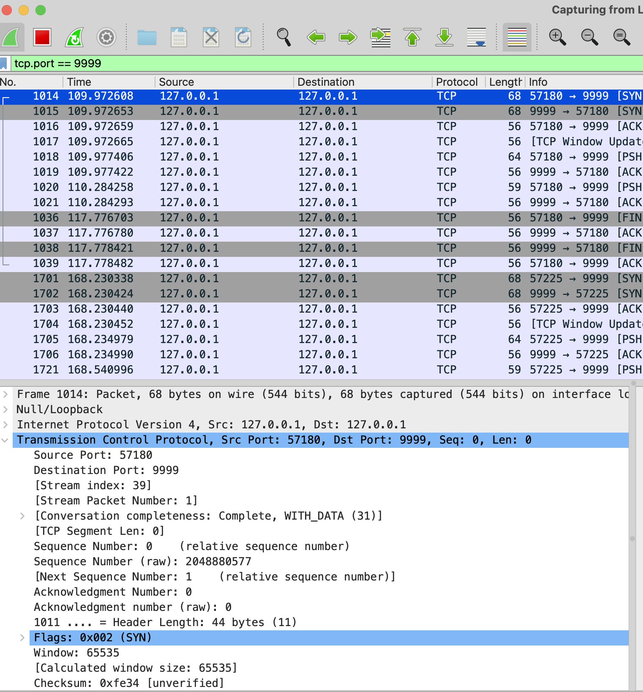
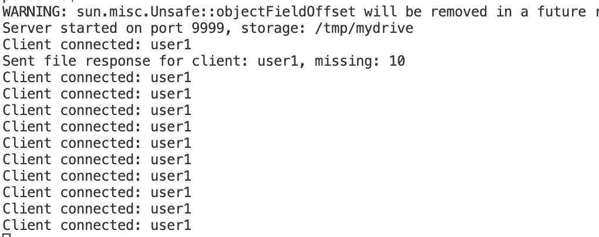
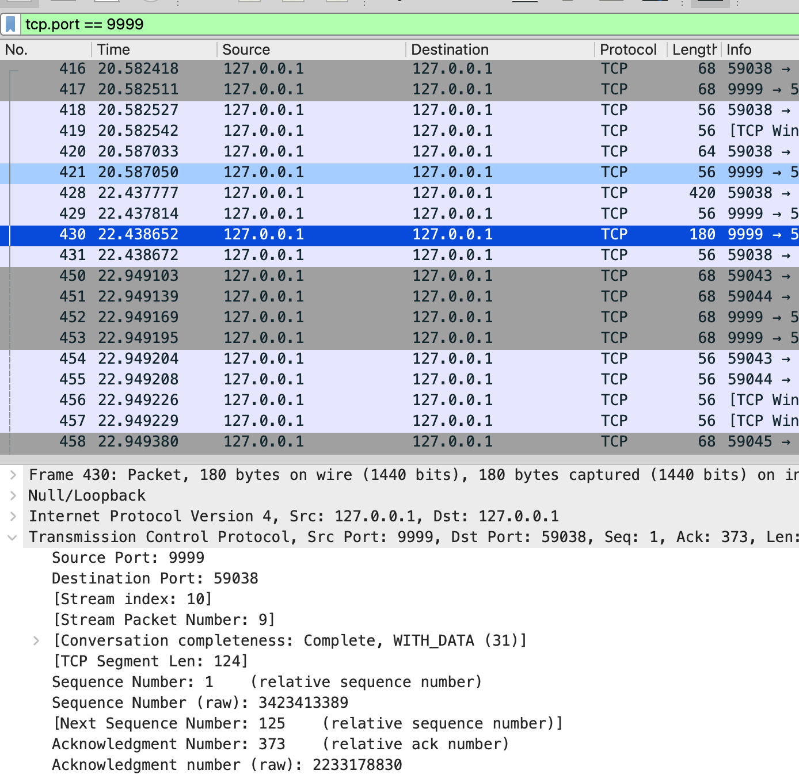
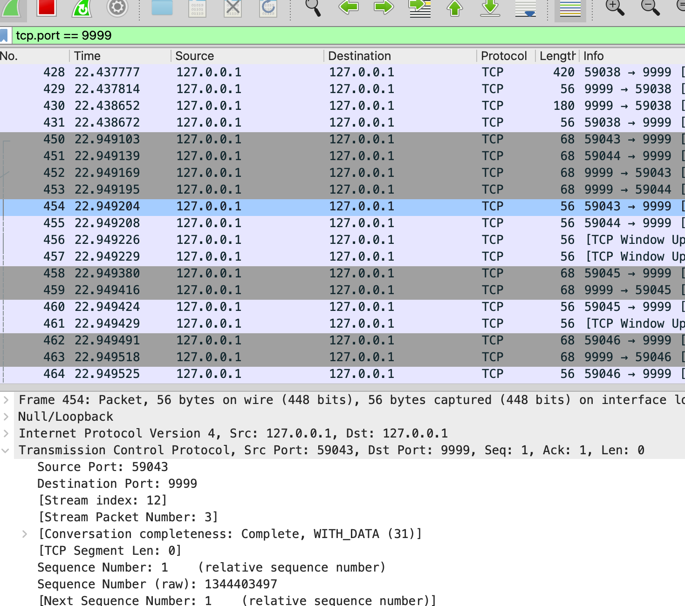
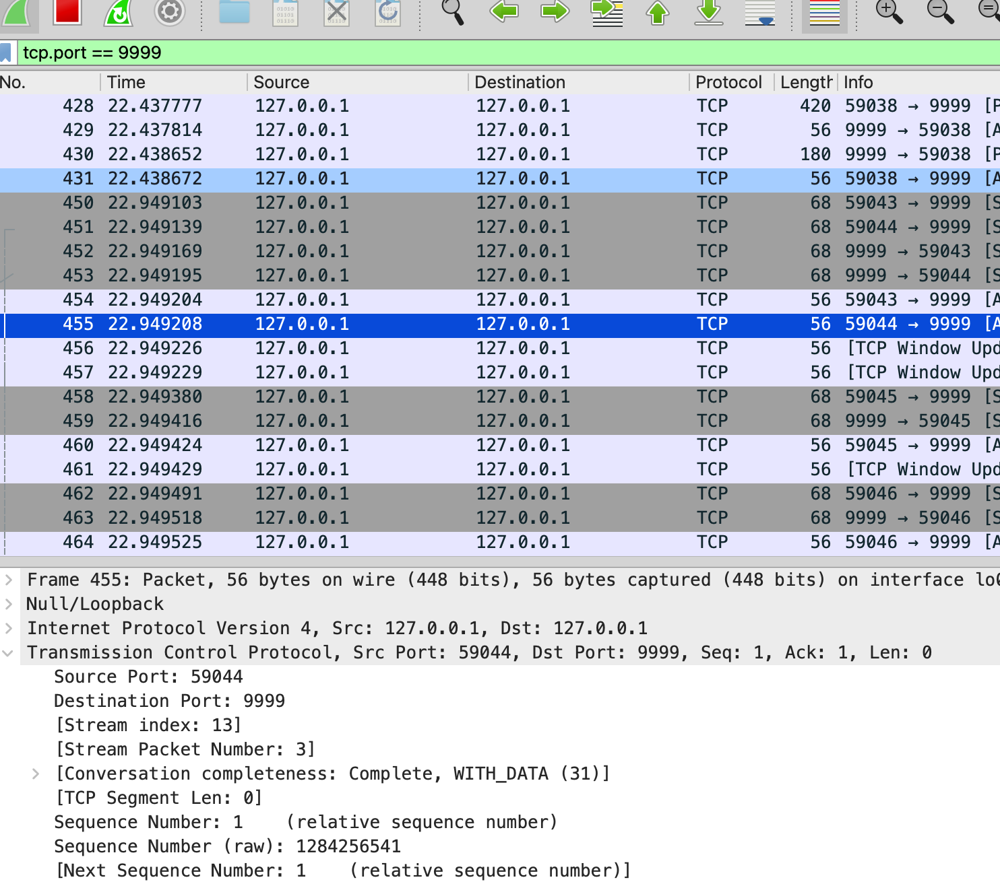
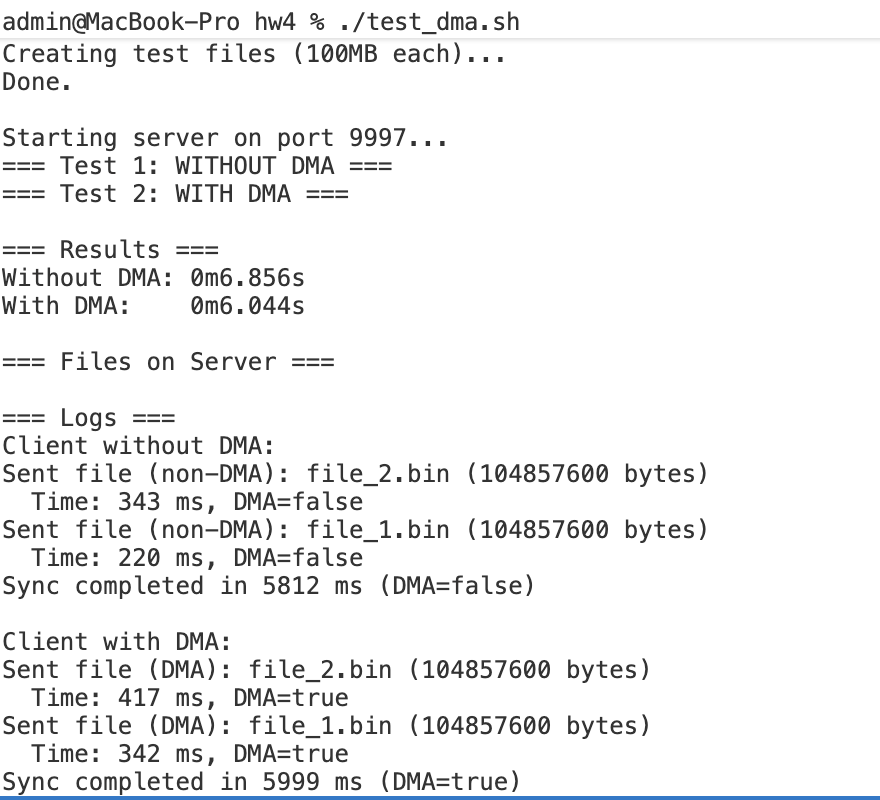

<style>
body {
    background-color: #f5f8b8fd;
    color: #333;
    padding: 50px;
}
pre, code {
    background-color: #e8e8e8;
}
</style>

# ОТЧЕТ ПО HW4

# Фролов Иван Григорьевич 
# БПИ-235 

### Цель работы

написать файловое хранилище MyDrive с использованием Java/Netty Framework и протокола TCP.

Хотим сделать клиент-серверное приложение, где:
- Клиент синхронизирует директорию с сервером
- Сервер хранит файлы каждого пользователя в отдельной директории
- Используется собственный протокол TCP для обмена сообщениями

**Язык программирования и Framework:** Java 11 / Netty Framework 4.1

---

### Структура проекта

```
mydrive/
├── protocol/
│   ├── Message.java                 (базовый интерфейс)
│   ├── MessageType.java            (константы типов сообщений)
│   ├── MessageEncoder.java          (сериализует сообщение в байты)
│   ├── MessageDecoder.java          (десериализует)
│   ├── ClientIdMessage.java         (ID клиента)
│   ├── FileListMessage.java         (список файлов с контрольными суммами)
│   ├── FileResponseMessage.java     (список отсутствующих файлов)
│   └── FileChunkMessage.java        (данные файла)
├── server/
│   ├── MyDriveServer.java           (стартуем сервер)
│   └── ServerHandler.java           (обработчик подключений)
├── client/
│   ├── MyDriveClient.java           (стартуем клиента)
│   └── ClientHandler.java           (обработчик ответов)
└── util/
    └── FileUtils.java              (вспомогательные функции)
```

### Протокол коммуникации

Основан на слайде №14 лекции №9:

```
Сообщение = [Type (1 byte)] [Length (2 bytes)] [Data (variable)]

Типы сообщений:
1. CLIENT_ID       - отправляет клиент при подключении
2. FILE_LIST       - список файлов клиента с контрольными суммами
3. FILE_RESPONSE   - сервер отвечает, какие файлы нужны
4. FILE_CHUNK      - передача содержимого файла
```

### Поток взаимодействия

```
1. Клиент подключается -> отправляет CLIENT_ID
2. Клиент сканирует локальную директорию и отправляет FILE_LIST
3. Сервер проверяет файлы -> отправляет FILE_RESPONSE
4. Клиент отправляет отсутствующие файлы через FILE_CHUNK
5. Сервер сохраняет файлы в /storage/[client_id]/[filename]
```

### Вот пример запуска 

Компилируем и очищаем облако      
`mvn clean package -DskipTests 2>&1 && rm -rf /tmp/mydrive`

Запуск сервера        
`java -jar target/mydrive-server.jar 9999 /tmp/mydrive`

Запуск клиента       
`./run_client.sh config.properties`

Создать тестовые файлы        
`./create_test_files.sh`    
Все файлы примерно по 100 мб 


Клиент коннектится к серверу, отправляет ему информацию о тех файлах, которые у него есть локально (то есть в папке ./test_files)

Далее сервер возвращает клиенту список имен тех файлов, которые он у себя не нашел в облаке (наше условное облако - это директория ~/tmp/mydrive)


Соответственно, дальше клиент отправляет серверу только те файлы, которых у него еще нет 

После этого можно посмотреть, что сервер получил все файлы в свое облако 


Можно посмотреть в WireShark, что TCP пакеты действительно перемещаются между клиентом и сервером




Флаг SYN - синхронизация        
PSH/ACK - пуш и потом acknowledge       
TCP Window update - технический флаг, сообщить о доступном размере буфера       

---

## Ключевые фрагменты кода

### 1. Message Decoder

```java
public class MessageDecoder extends ByteToMessageDecoder {
    @Override
    protected void decode(ChannelHandlerContext ctx, ByteBuf in, List<Object> out) {
        if (in.readableBytes() < 4) return;
        
        in.markReaderIndex();
        int messageType = in.readByte();
        
        if (messageType == MessageType.CLIENT_ID) {
            int idLength = in.readShort();
            if (in.readableBytes() < idLength) {
                in.resetReaderIndex();
                return;
            }
            byte[] idBytes = new byte[idLength];
            in.readBytes(idBytes);
            out.add(new ClientIdMessage(new String(idBytes)));
        }
        // ... другие типы сообщений
    }
}
```

**Суть:** используем ByteToMessageDecoder для обработки потока байтов из TCP соединения.
Проверяем наличие данных перед чтением без блокировки, потом десериализуем в объекты.

### 2. Message Encoder

```java
public class MessageEncoder extends MessageToByteEncoder<Message> {
    @Override
    protected void encode(ChannelHandlerContext ctx, Message msg, ByteBuf out) {
        if (msg instanceof ClientIdMessage) {
            ClientIdMessage m = (ClientIdMessage) msg;
            out.writeByte(MessageType.CLIENT_ID);
            out.writeShort(m.getClientId().length());
            out.writeBytes(m.getClientId().getBytes());
        }
        // ... другие типы
    }
}
```

**Суть:** преобразуем объекты Java в последовательность байтов для отправки по TCP.

### 3. Server Handler (обработка клиентов)

```java
public class ServerHandler extends SimpleChannelInboundHandler<Message> {
    private String clientId;
    private String storageDir;
    private Map<String, byte[]> serverFiles = new HashMap<>();

    @Override
    protected void channelRead0(ChannelHandlerContext ctx, Message msg) {
        if (msg instanceof ClientIdMessage) {
            clientId = ((ClientIdMessage) msg).getClientId();
            String clientDir = storageDir + File.separator + clientId;
            FileUtils.getOrCreateDirectory(clientDir);
            loadServerFiles(clientDir);
            
        } else if (msg instanceof FileListMessage) {
            FileListMessage m = (FileListMessage) msg;
            FileResponseMessage response = new FileResponseMessage();
            
            for (FileListMessage.FileInfo file : m.getFiles()) {
                byte[] serverChecksum = serverFiles.get(file.fileName);
                if (serverChecksum == null || !Arrays.equals(serverChecksum, file.checksum)) {
                    response.addMissingFile(file.fileName);
                }
            }
            ctx.writeAndFlush(response);
            
        } else if (msg instanceof FileChunkMessage) {
            FileChunkMessage m = (FileChunkMessage) msg;
            // Сохраняем файл в clientDir
            // Вычисляем контрольную сумму после полного получения
        }
    }
}
```

**Суть:** для каждого подключения Netty создает отдельный handler.  
Каждый клиент управляется независимо в одном потоке события.    
Поддерживается неограниченное число клиентов (event loop group).    

### 4. Клиентская логика

```java
public void sync() throws Exception {
    Channel channel = connect();
    
    sendClientId(channel);
    Thread.sleep(500);
    
    Map<String, FileInfo> localFiles = scanLocalDirectory();
    sendFileList(channel, localFiles);
    Thread.sleep(500);
    
    List<String> missingFiles = waitForResponse(channel);
    sendMissingFiles(channel, localFiles, missingFiles);
    
    channel.close().sync();
}
```

Суть: коннектится к серверу, сообщает свое id, отправляет список файлов, получает список MissingFiles, отпарвляет недостающие файлы 


---

## Сериализация сообщений

Каждый тип сообщения имеет фиксированный формат:

```
ClientIdMessage:
  [1 byte: type=1][2 bytes: id_length][id_length bytes: id]

FileListMessage:
  [1 byte: type=2][2 bytes: file_count]
  [для каждого файла]:
    [2 bytes: name_length][name_length bytes: name]
    [8 bytes: file_size]
    [16 bytes: checksum]

FileChunkMessage:
  [1 byte: type=4][2 bytes: name_length][name_length bytes: name]
  [8 bytes: total_file_size][N bytes: chunk_data]
```

---

Тут дальше будем реализовывать parallel и DMA 

Общая концепция: 
- сервер пассивный, он просто принимает и обрабатывает, что ему придет. Уже поддерживает параллельные клиенты из коробки. 
- Клиент может выбирать стратегию отправки (последовательно / параллельно) и метод отправки (с копированием или DMA)

### Параллельная отправка нескольких файлов 

Для этого написан отдельный клиент `MyDriveClientParallel.javas`  
Он создает пул потоков и до `max.connections` одновременных подключений, каждое подключение отправляет отдельный файл   
Сервер уже умеет работать с многопоточностью 

#### Сценарий №1: один клиент с несколькими потоками 

**Терминал 1: Очищаем облако и перезапускаем сервер**
```bash
rm -rf /tmp/mydrive
java -jar target/mydrive-server.jar 9999 /tmp/mydrive
```

**Терминал 3: Запускаем параллельного клиента**
```bash
java -cp target/mydrive-server.jar mydrive.client.MyDriveClientParallel config.properties
```



Более наглядно можно видеть в WireShark, что создается несколько подключенией. То есть у нас несколько портов для клиента. 







Тут мы видим порты 59038, 59043, 59044  

#### Сценарий №2: несколько клиентов

**Запустить скрипт тестирования: он запустит и сервер, и клиентов**
```bash
chmod +x test_parallel.sh
./test_parallel.sh 2 true 9998
```

Параметры:
- `3` — число клиентов
- `true` — использовать параллельный режим (или `false` для последовательного)
- `9998` - порт 

Можно посмотреть на tcp dump (результаты в файле `tcp_analysis.txt`)

Что можно сказать: 
1. MSS = 16344 байт. Window Start = 65535 → уменьшается до 4332 (Flow Control)
2. Медленный старт в первые 400ms 
3. Пакеты растут: 8B → 69B → 16KB → 65KB 
4. Congestion нет (у нас локальное соединение)
5. Flow Control работает, 2 независимых соединения 

---

### Использование DMA 

Для этого есть отдельный клиент `MyDriveClientDMA.java`

Там изменение `sendFile` на использование `channel.writeAndFlush(new DefaultFileRegion(file,0,file.length()))` и предварительная отправка заголовка с именем/размером

Запустить все для проверки можно скриптом   
`test_parallel.sh`

Что получается: 



#### Результаты DMA теста

Общие времена:  
- Без DMA: 6.856s
- С DMA: 6.044s
- Ускорение: 0.8s (11.8% быстрее)

Пропускная способность: 
- Без DMA: 200MB ÷ 6.856s = 29.2 MB/s
- С DMA: 200MB ÷ 6.044s = 33.1 MB/s
- Прирост: +13%

Эффект тут получился небольшой 

----

Фух, вроде все 