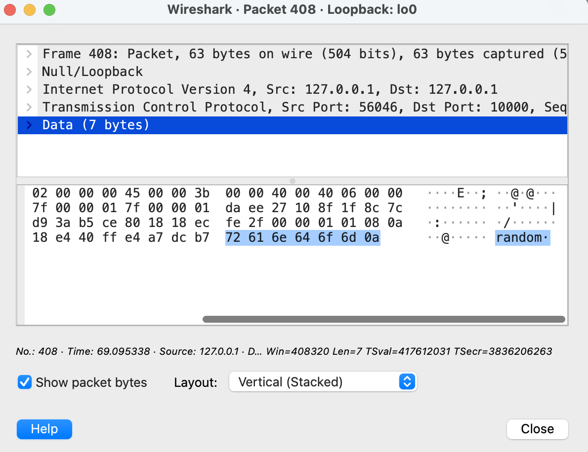

# Task

How to start

In one terminal start a server: `mvn exec:java -Dexec.mainClass="test.Server"`

In another terminal start a client `mvn exec:java -Dexec.mainClass="test.Client"`

Results: 

Client sends a random message to the server

Server sends date and time to the client
